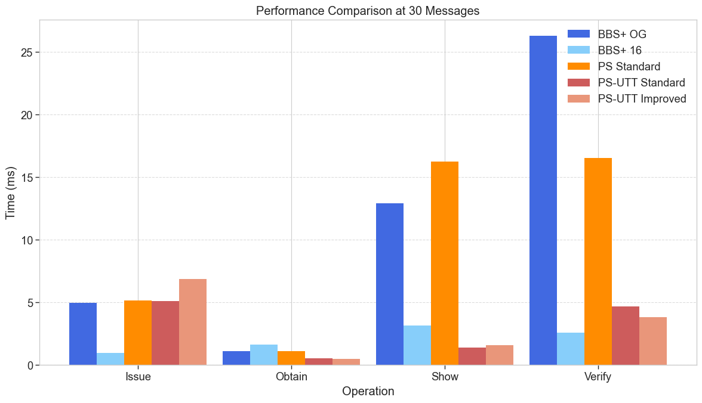

# Anonymous Credentials Benchmarking

This project is to benchmark Anonymous Credential Schemes while trying to be as consistent as possible with security parameters and algorithms.

I was confused to find comparisons made between schemes and wondered how fair they were. Some schemes were built with modern pairing libraries and showed their practical efficiency improvement over other schemes with older libraries. Some used optimizations like Multi-Scalar-Multiplication, where others exponentiated each group element individually and added individually. Similarly, some used Optimized Pairings and Miller Loop computation and others computed pairings individually. Some used python, C++, Rust libraries. etc..

I hope to retain consistency as much as possible for fair practical comparison.

Currently I am benchmarking Anonymous Credential schemes in the Obtain, Issue, Show, Verify syntax from SPS-EQ

# Current

- PS OG version from [PS06](https://link.springer.com/chapter/10.1007/978-3-319-29485-8_7)
- PS from [UTT](https://eprint.iacr.org/2022/452.pdf) + an improvement by Lovesh Harchandani and I
- BBS+ OG version from [AMS06](https://www.researchgate.net/publication/220337024_Constant-size_dynamic_k-TAA)
- BBS+ from [CDL16](https://eprint.iacr.org/2016/663)
- Threshold PS with Shamir SS

# Near Future plans

- SPS-EQ
- Threshold BBS+
- Coconut

# Future plans

- compare with PQC constructions
- make more beautiful reusable shared componenents for the library
- test with different curves

# Credits

- [Lovesh Harchandani](https://github.com/lovesh) as you'll notice the structure of my libraries, proof system/schnorr library is very much inspired/borrowed from him
- Claude Sonnet 3.5, 3.7 + reasoning, Grok3 Thinking

